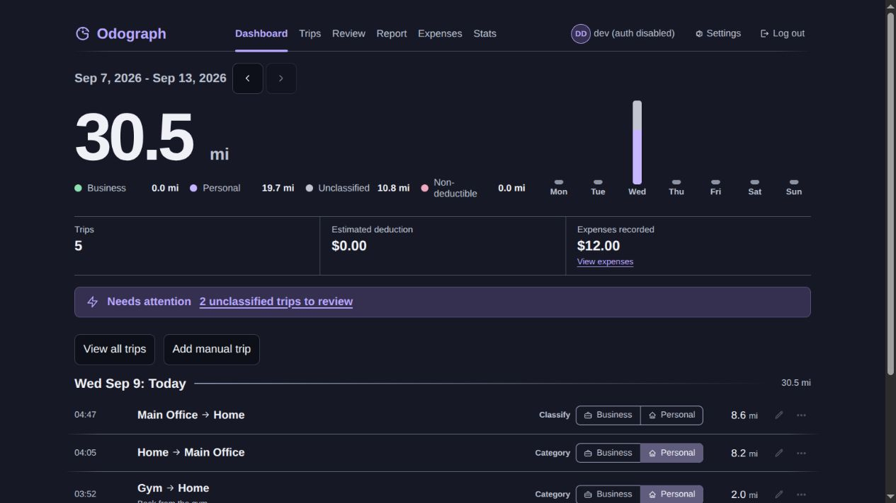

# Odograph

Odograph is a self-hosted mileage tracker that uses
[OwnTracks](https://owntracks.org/) to record your drives automatically.

It can:

- Detect trips from your phone's location history
- Mark trips as business or personal
- Let you add or edit trips by hand
- Show trip routes on a map
- Track vehicle expenses
- Calculate estimated IRS mileage deductions
- Compare tracked mileage against your vehicle's odometer
- Remind you about trips that still need to be categorized

Your stored trips, points, places, vehicles, expenses, and reports stay on
your own server. Map pages request tiles from OpenStreetMap by default, from
your browser while you view a map. The [privacy guide](docs/privacy.md)
explains exactly what each option sends outside your instance. The
[security guide](docs/security.md) covers the trust model and a hardening
checklist.



*Example dashboard using synthetic locations and account data.*

Start with [Install](#install), then see [Use Odograph](docs/usage.md).

> **US users only:** Odograph's deduction reports use IRS standard mileage
> rates. Trip tracking still works anywhere, but the tax figures are only
> meaningful for US filers.

## Install

The recommended path is the full release checkout and
`scripts/generate_env.sh` walkthrough below. If you already manage Compose,
you can use the [minimal Compose installation](docs/install-compose.md) with
only the two release files.

### What you need

- A Linux server or VM
- Git
- Either [Docker Engine](https://docs.docker.com/engine/install/) with the
  [Compose v2 plugin](https://docs.docker.com/compose/install/) (`docker
  compose`) or [Podman](https://podman.io/docs/installation) with
  [podman-compose](https://github.com/containers/podman-compose) 1.3.0 or
  newer. The old `docker-compose` v1 will not work.
- OpenSSL or Python 3 on the host, used to generate your secrets
- `curl`, for health checks
- A domain name pointing at the host
- A reverse proxy that terminates HTTPS
- About 2 GB of RAM and 5 GB of free disk to start

Linux is what Odograph is tested and supported on. Docker Desktop or
`podman machine` on macOS or Windows will probably work, but they are not
tested, so they are not claimed. If you try one and hit a problem, open an
issue and I will help track it down.

This checkout's `compose.yaml` uses the signed native PostgreSQL
16.15/PostGIS 3.6.4 image for Linux AMD64 and ARM64. When a target release
uses it, an installation that still uses the older `postgis/postgis:16-3.4`
image must read the
[PostGIS database image upgrade procedure](docs/upgrading.md#upgrading-the-postgis-database-image)
before starting the target release.

Your phone posts location updates all day, so Odograph works best on a machine
that stays awake rather than one that sleeps.

## Quick start

Pick a published version from the
[GitHub Releases page](https://github.com/MeandrousShark/odograph/releases).
Replace `vX.Y.Z` below with that exact release tag:

```sh
git clone --branch vX.Y.Z --depth 1 https://github.com/MeandrousShark/odograph.git
cd odograph
scripts/generate_env.sh
```

Open `.env`, set your timezone, and disable browser signup before starting the
stack:

```env
DISPLAY_TZ=America/Los_Angeles
INITIAL_ADMIN_SIGNUP=0
```

Use your own [IANA timezone name](https://en.wikipedia.org/wiki/List_of_tz_database_time_zones).
This sets the first-account suggestion. After setup, **Settings > Time zone and
notifications** controls the saved timezone and notification preferences.

That generated file is already a working local-login setup. All three required
secrets are filled in and every optional integration is switched off. You only
need the [configuration reference](docs/configuration.md) when you want to
change something.

### Start Odograph

With Docker:

```sh
docker compose up -d
```

Or with Podman:

```sh
podman-compose up -d
```

Compose downloads the immutable image tag pinned by the checked-out release, so
you always get exactly the version you checked out.

Run `docker compose ps` until both services report `healthy`:

```sh
docker compose ps
# or: podman-compose ps
```

Then check that the app answers on the host:

```sh
curl -fsS http://127.0.0.1:8077/healthz
```

That address is for local health checks and your reverse proxy only. It is not
how you use Odograph day to day.

### Create your account before public access

Create the only administrator from the running app container. This reads the
email and password interactively and accepts no password argument:

```sh
docker compose exec app python -m app.manage_account create-admin
# or: podman-compose exec app python -m app.manage_account create-admin
```

Keep `INITIAL_ADMIN_SIGNUP=0`. The account command works with browser signup
disabled, so the public `/signup` route never lets an unknown visitor create
the first account.

If an account already exists, this command refuses to replace it. Use the
password recovery command below when you need to recover an existing account.

## Set up HTTPS

Point your reverse proxy at `127.0.0.1:8077` and give it your domain, for
example `https://mileage.example.com`. The
[reverse proxy guide](docs/reverse-proxy.md) has worked examples.

Odograph requires HTTPS for browser sign-in, because its session cookies are
marked Secure. Confirm this works before going further:

```text
https://mileage.example.com/healthz
```

Then visit `https://mileage.example.com/login` and sign in with the
administrator account you created above.

You can manage your password and optional sign-in providers later under
**Settings, then Account Settings**.

## Connect OwnTracks

Follow the [OwnTracks guide](docs/owntracks.md) to connect your phone. It walks
through sending a test track, confirming Odograph received it, and deleting the
test data afterward.

Create a device in **Settings > Tracking**, then copy its issued username and
one-time password into OwnTracks. Each credential identifies one device;
`tid` is a label. Once that works, Odograph starts detecting trips on its own.

## Use Odograph

After you sign in, follow [Use Odograph](docs/usage.md) for a task-oriented
guide to vehicles, trips, review, expenses, odometer readings, reports, and
exports.

## Backups

Before you rely on Odograph, make a backup:

```sh
scripts/backup_database.sh --output backups/first-install.dump
```

The script validates the archive table of contents and writes a checksum
sidecar plus a non-secret manifest. `scripts/restore_database.sh --verify-only`
checks that checksum and table of contents without restoring
anything, so it is useful after copying an archive but does not prove that a
database can be recovered. For a real restore test, follow the fresh-target
procedure in [Backups and disaster recovery](docs/backups.md). Keep the archive,
its `.sha256` and `.manifest` files, and an encrypted copy of `.env` somewhere
off this host.

Your data lives in the Compose `dbdata` volume. Restarts, container recreates,
and ordinary `down` then `up` cycles all keep it. What destroys it is:

```sh
docker compose down -v
```

or the Podman equivalent. Only run that when you actually mean to erase the
database.

## Security

Normal installations remain single-account. Account ownership is explicit in
queries, restricted database roles are active, and row-level security is
enabled and forced on every account-owned table. Do not operate a normal
installation as a multi-user service. See the
[database role contract](docs/configuration.md#account-ownership-and-database-roles).

Before relying on your installation, work through the
[security hardening checklist](docs/security.md#hardening-checklist).

If you change the default networking, also review
[reverse proxy trust](docs/reverse-proxy.md#trusting-forwarded-headers).

The app container runs as a fixed non-root user, UID and GID `10001`, and
writes nothing to disk. That only matters if you mount a host directory into
it yourself, in which case that path has to be readable, and writable if it is
written to, by `10001`.

## Optional features

Odograph needs none of these. Every setting is in the
[configuration reference](docs/configuration.md#external-services), and if a
feature sends anything off your server the [privacy guide](docs/privacy.md)
spells out what.

- **OIDC sign-in** through a compatible identity provider
- **Reverse geocoding** to turn coordinates into readable addresses
- **ntfy or email reminders** for trips still waiting to be categorized
- **OSRM** for self-hosted road snapping and better route maps

### OIDC

OIDC can be linked as a second way to sign in to an existing account. The
administrator configures one OIDC provider for the instance.

Register `https://mileage.example.com/auth/callback` with your provider and set
the three OIDC variables. To link it to an existing password account, open
**Settings > Account Settings** while signed in, enter your current password,
and authorize with the provider.

After linking, either method signs you into the same account. The link follows
the provider's issuer and subject, so it survives your email address changing
there. Invitation redemption without a local password and OIDC-only method
management are implemented for controlled activation fixtures. Normal
installations retain the single-account database guard; these flows are not
available for regular use until a separately reviewed activation migration is
released. When enabled, OIDC-only security actions require fresh provider
authentication with a valid `auth_time` from a provider that honors
`max_age=0`. See the
[authentication settings](docs/configuration.md#authentication-and-ingest) for
details, and [Upgrading](docs/upgrading.md) if you are moving an older
OIDC-only installation.

In controlled activation fixtures, an enabled administrator can issue, resend,
and revoke member invitations in **Admin > Accounts**. The new invitation link
and manual token are shown once; optional email sends that same invitation.
Resending creates a fresh token and invalidates the old one. The normal
single-account installation cannot use invitations to add accounts until
multi-account activation is separately released.

In **Settings > Account Settings**, you can verify your current login email or
change it after confirming the new address. These actions require your current
password and configured email delivery. Until a new address is confirmed, the
current email remains the login. A confirmed change signs out other Odograph
sessions; it does not change the linked OIDC identity or saved notification
destinations. Email verification is not a password reset flow.

### Reverse geocoding

Odograph supports Geoapify as a hosted provider and Nominatim as a self-hosted
one. Read the
[configuration reference](docs/configuration.md#external-services) and the
[privacy guide](docs/privacy.md) before turning either on.

### OSRM

OSRM is optional and entirely self-hosted. It needs road data prepared for your
region ahead of time, and it can want considerably more memory and disk than
Odograph itself. See the [OSRM guide](docs/osrm.md).

## Password recovery

While signed in, open **Settings**, then **Account Settings**, and use
**Change password** under **Security**.

If your login email is verified, choose **Forgot password?** on the sign-in
page to reset a forgotten password. This needs SMTP and `APP_URL`; see
[Email](docs/configuration.md#email). The link goes only to your verified
login email and expires in 30 minutes. Completing a reset signs that account
out of every Odograph session, including the browser that used the link, and
returns you to sign-in.

In a controlled multi-account fixture, an enabled administrator can request a
reset for another account in **Admin > Accounts**. The link goes only to that
account's stored, verified login email; the administrator never sees it or
chooses a password. Without a verified address, use the trusted host-local
recovery command below.

Otherwise, reset it from the server. Find the account ID, then confirm the
account shown and type the new password when prompted:

```sh
docker compose exec app python -m app.manage_account list-accounts
docker compose exec app python -m app.manage_account reset-password ACCOUNT_ID
# or: podman-compose exec app python -m app.manage_account reset-password ACCOUNT_ID
```

Use `create-admin` instead when no account exists yet and public signup is
closed.

A password change signs out your other Odograph sessions; the browser that made
the change stays signed in. An operator reset signs out every session for that
account. Neither changes a linked sign-in provider, verified email or tracking
devices.

**Sign out everywhere** in Account Settings ends every Odograph browser
session for your account, including the one you are using. It does not end a
sign-in provider session or revoke tracking-device credentials.

Establishing a password for an OIDC-only account and managing its sign-in
methods are currently limited to controlled activation fixtures. They will be
available for normal installations only after supported account activation is
released.

Changing your login email is separate from password recovery. The new address
becomes the login only after you confirm the emailed challenge.

If you use OIDC, signing out of Odograph does not sign you out of your identity
provider, so signing back in may not prompt you at all. Sign out of the
provider separately to end that session. Odograph does not keep provider tokens
after sign-in.

## Updating

When a new release comes out, follow the [upgrading guide](docs/upgrading.md).
Take a fresh backup and verify it first, then move from one exact release tag
to the next. Watch the GitHub Releases page to hear about new versions.

The registry also publishes a floating tag for each minor version, such as
`v0.8`, which points at the newest patch within that minor release. Use a
floating tag only when you have chosen that update policy deliberately and
have read the release notes. There is no `latest` tag. Minor releases can add
one-way database migrations, so moving back means restoring a backup rather
than switching the image.

## Contributing

Development happens in this repository through pull requests. Its `main`
branch may contain unreleased work, so use an immutable release tag for
installations. Want to run the test suite or work on the code? See
[CONTRIBUTING.md](CONTRIBUTING.md) for development setup and local instructions.

## Support

Odograph is self-hosted open-source software, not a hosted service. Only the
latest release is supported, by one maintainer, on a best-effort basis. There
is no service-level agreement or guaranteed response time.

Check [Known issues](docs/known-issues.md) for confirmed problems in
published releases and their workarounds. Open a GitHub issue for bugs and
feature requests. See [SECURITY.md](SECURITY.md) for security reporting and
supported versions, and [CONTRIBUTING.md](CONTRIBUTING.md) for project scope.

## AI assistance

AI tools were used as development assistants on this project: implementation,
debugging, testing, review, and documentation. I directed the product and
design decisions, and I reviewed and tested the resulting work before release.

Every release is signed and traceable to the exact source commit and CI run
that built it. The verification commands are in
[docs/releasing.md](docs/releasing.md).

## License

AGPL-3.0. In short: you are free to use, modify, and self-host this project,
but if you run a modified version as a network service that other people use,
you must offer that version's source to those users. See [LICENSE](LICENSE) for
the full text.

Copyright (C) 2026 Michael Hannon.
