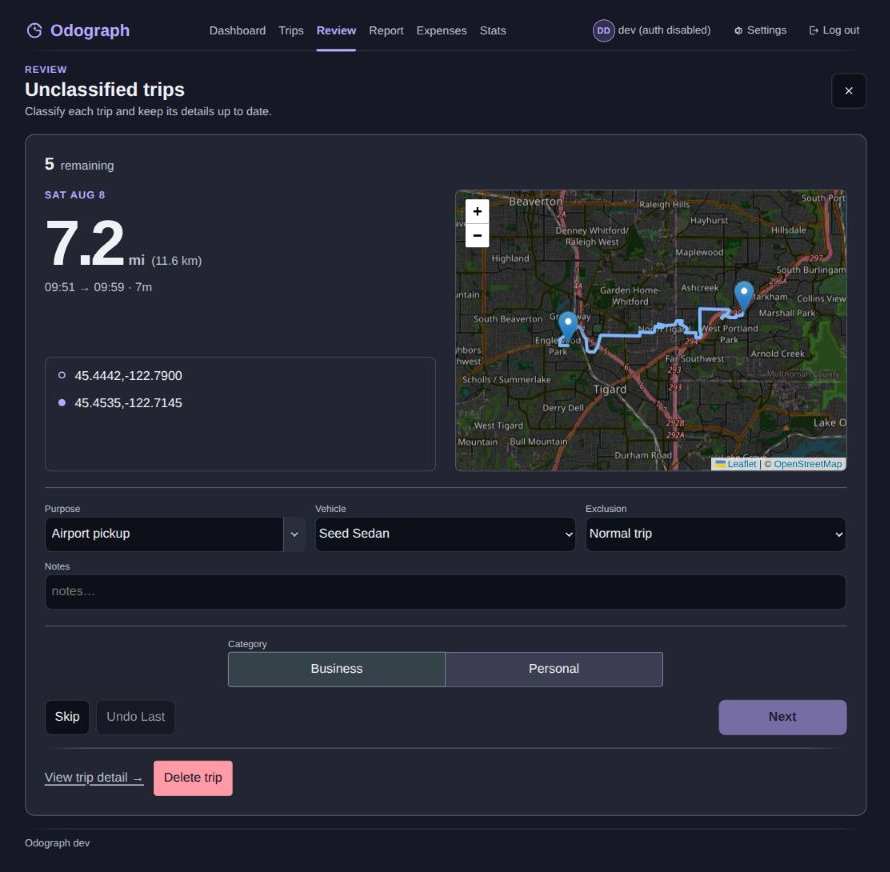

# Using Odograph

This guide covers everyday use after sign-in. For installation, see the
[installation instructions](../README.md). For phone setup, use
[Connecting OwnTracks](owntracks.md). Odograph is a single-administrator,
self-hosted application. Multiple devices and vehicles can feed that account,
but the app does not provide separate user accounts.

On a desktop browser, the main navigation shows **Dashboard**, **Trips**,
**Review**, **Report**, **Expenses**, and **Stats**, with a **Settings** link in
the header. On a phone, **Week** opens the Dashboard, **More** contains
Expenses and Stats, and Settings is under the avatar or initials menu.

## First trip to first report

1. **Add a vehicle.** Open **Settings**, expand **Add vehicle** under
   **Vehicles**, enter a name, and choose **Make default** if appropriate.
   Make, model, and plate are optional. Select **Add**. To assign this default
   automatically to newly detected trips, turn on **Assign the default vehicle
   to newly detected trips** under **Vehicles**.

2. **Connect your phone.** Follow [Connecting OwnTracks](owntracks.md) to set
   up HTTP mode and the `/ingest` address. That guide also includes a
   synthetic test track if you want to check the pipeline without driving.

3. **Confirm that data arrived.** In **Settings**, expand **Diagnostics** and
   look at **Device status**. It shows the latest received fix, latest
   recorded time, and point count for each OwnTracks device. A point there
   proves that the phone reached Odograph. A completed trip is a separate
   result of the trip detector, so it can take longer after you stop. The
   detector runs after new points stop arriving and checks again on a schedule,
   so allow a little time after the final point. The synthetic test track asks
   you to wait about 90 seconds.

4. **Classify the trip.** Open **Trips**, find the new detected trip, and
   choose **Edit trip**. Set **Vehicle**, choose **Business** or **Personal**,
   enter the **Purpose**, and select **Save**. You can also use the inline
   Business or Personal controls in a trip row, then add the purpose from the
   edit card or trip detail page.

5. **Open the report.** Select **Report**. The annual report shows mileage,
   rates, deduction estimates, monthly totals, and vehicle totals. If a rate
   is missing, add it under **Settings**, **Mileage rates**. Select **Export
   XLSX** for a workbook. The Trips page's **Export** menu also provides CSV
   and XLSX for the current archive filters.

## Guide map

- [Dashboard and daily review](#dashboard-and-daily-review)
- [Finding and correcting trips](#finding-and-correcting-trips)
- [Places, rules, and vehicles](#places-rules-and-vehicles)
- [Recordkeeping](#recordkeeping)
- [Taking data out](#taking-data-out)
- [Common questions](#common-questions)

## Dashboard and daily review

### Dashboard

The Dashboard is a weekly view. Use **Previous week** and **Next week** to
move between weeks. The current week has no active Next week control. When
viewing another week, select **Current week** beside the arrows. The week
heading is also a shortcut to the current week. The headline total, category
breakdown, daily bars, trip count, estimated deduction, and recorded expenses
all refer to the displayed week.

The four mileage states are:

- **Business:** mileage marked for business use and used for the standard
  mileage deduction estimate when a rate is available.
- **Personal:** your own non-business driving.
- **Unclassified:** no Business or Personal decision yet. It appears in the
  attention area and Review queue.
- **Non-deductible:** mileage from a trip marked **My vehicle, someone else
  drove**. It remains in total vehicle mileage, but not in business mileage or
  deduction estimates. This is an exclusion state, separate from Category.

The **Needs attention** area links to unclassified trips and possible missing
trips. **View all trips** opens the archive. **Add manual trip** opens the
dedicated manual-entry page.

*Synthetic example data showing the weekly total, category breakdown, daily
mileage, attention link, and Business or Personal row controls.*

### Review

Open **Review** from the main navigation or the Dashboard attention link.
Review shows only unclassified trips, one card at a time. You can edit
**Purpose**, **Vehicle**, **Exclusion**, and **Notes** before choosing a
category.

Choose **Business** or **Personal**, then select **Next**. Next saves the
category and other visible fields together, then advances. Next is disabled
until one of those two categories is selected.

Select **Skip** to advance without applying the draft category. Other visible
edits, including Purpose, Notes, Vehicle, and Exclusion, stay on that trip.
**Undo Last** reverses the most recent Review action. After Next it brings back
the trip and clears the category saved by that action. After Skip it brings the
trip back without reversing Purpose, Notes, Vehicle, or Exclusion edits. The
undo action is cleared when you reload the page. **Close review** and **Back to
trip list** return to Trips.

*Synthetic example showing the Review fields and explicit Next, Skip, and Undo
Last actions. The map uses the configured tile provider.*

### Categories and exclusions

Category and Exclusion answer different questions. Category describes the
trip. Exclusion describes whether the trip belongs in mileage totals.

- **Normal trip:** no exclusion. Business, Personal, or Unclassified controls
  the normal totals.
- **Not one of my vehicles:** removes the trip from Dashboard totals and trip
  counts, reports, Stats totals, vehicle totals, odometer reconciliation, and
  missing-trip attention. Use it when none of your vehicles was involved.
- **My vehicle, someone else drove:** keeps the miles in total and vehicle
  mileage, but removes them from business mileage and deduction estimates. It
  is separate from Personal so another person's driving is not confused with
  your own personal driving.

The exclusion can be set in Review, Trip Detail, the trip edit card, manual
entry, or the archive's bulk **Exclusion** action. Clearing it restores
**Normal trip** while retaining the category.

## Finding and correcting trips

### Trips archive

Open **Trips** to browse the archive. Search matches notes, purposes, saved
places, and addresses. The filters include Category (All, Business, Personal,
Unclassified), Date (All dates, This month, Last month, This year, Custom),
From and To for a custom range, Vehicle (All, Unassigned, or a named vehicle),
and Exclusion (All, Normal trips, or either exclusion). **Clear** removes
active filters.

Results are grouped by month. Select **Load more** at the end of a month to
browse its next page. An archive export uses the filters currently shown.

Each row links to **Trip detail**. **Edit trip** opens an inline card with
**Save** and **Cancel**. Inline Business and Personal buttons change a
category immediately. The row's **More trip actions** menu can clear a
category, add a manual trip for a possible missing-trip gap, or delete the
trip.

To update several trips, select their checkboxes. In the filter and status
area, **Select all matching** selects every trip matching the current filters,
including trips on unloaded pages and in other months. This is a snapshot taken
when you select it, so trips arriving later are not included. The selection
keeps its explicit trip IDs through pagination and successful bulk-update
refreshes. Changing filters or navigating archive history clears it. You can
deselect visible rows individually or choose **Clear selection**. Failed
requests and actions keep the selection for retry.

On desktop, the selection bar provides **Category** (Business, Personal, or
Unclassified), **Purpose** (set or clear), **Vehicle** (assign or clear),
**Exclusion** (Normal trip or either exclusion), **More**, then **Merge
selected...**, **Delete selected**, and **Clear selection**. On phones, a
compact strip shows the selected count. Tap **Actions** to open a panel with
the same controls. A successful **Delete selected**
clears the selection. If any selected trip is missing, the whole bulk action
fails and the selection remains.

Deleting selected trips keeps linked expenses and stored location points.
Detected trips can be restored from **Settings**, while manual trips are
permanently deleted.

### Trip Detail

Trip Detail shows route, date, time, duration, point count, distance, and
whether the trip is Detected or Manual. A detected trip can show a road-snapped
distance and raw GPS distance. If snapping is pending or failed, the page says
it is showing raw GPS distance.

Change **Category**, **Vehicle**, **Exclusion**, **Purpose**, or **Notes** on
the detail page; these controls save when changed. Detected trips with stored
GPS points also have **Advanced trip tools**:

- **Merge with previous trip** or **Merge with next trip** combines adjacent
  detected trips from the same device. The form can keep or replace category,
  purpose, notes, and vehicle.
- **Split trip** enables map-pick mode. Choose a real GPS point on the route,
  review the confirmation, and submit. Very short halves are refused.

A manual trip with **No route** can include **Name start location** and **Name
end location**. These are per-trip labels, not saved Places.

The archive's **Merge selected...** action has the same rules: selected trips
must be contiguous detected trips from one device, and all must be visible in
the current archive view. Imported and manual trips cannot be merged. A merge
or split recalculates nearby trips for the affected device, so boundaries and
distance can change. Settings contains **Manual trip edits**, where **Undo**
reverses a stored merge or split and **Restore** brings back a deleted detected
trip.

### Add a manual trip

Select **Add manual trip** from Dashboard or Trips. Enter **Date**, **Start**,
**End**, and the trip details. The **now** buttons use the configured display
timezone. If End is at or before Start, Odograph treats the trip as overnight.
Choose category, vehicle, exclusion, purpose, and notes as needed.

Choose one Route mode:

- **No route:** enter optional Start location name and End location name. A
  positive **Distance (mi)** is required.
- **Named places:** choose a saved Start place and End place. If routing is
  available, Odograph previews the road route and fills the distance.
- **Pick on map:** click the map once for the start and once for the end. Use
  **Reset points** to choose them again.

With Named places or Pick on map, an available routing service previews the
route and fills Distance. You can enter a different positive distance to
override that preview. If routing is unavailable, a trip can still save when
you enter a distance; Trips shows a notice that the entered distance was used.
A routed form with no distance and no available route cannot save. See the
[OSRM guide](osrm.md) for the optional self-hosted routing service.

When a trip row shows **Possible missing trip**, select **Add missing trip**
from its More menu. The form pre-fills date, start time, and notes. With
routing configured, it may also show a suggested road distance between the
surrounding trip endpoints. Review every field before selecting **Add**.

## Places, rules, and vehicles

### Saved Places and automatic rules

In **Settings**, under **Places**, select **Add place**. Enter a Name,
choose **Home**, **Work**, or **Other**, provide latitude and longitude, and
set a positive **Radius (m)**. If a geocoder is configured, Address search can
fill the coordinates. Saved places name trip endpoints and match automatic
classification rules.

Under **Auto-tag rules**, select **Add rule**. Each side can match a place
kind, a Specific place, or Any. Choose Business or Personal as the result.
Rules match the two endpoints in either direction. Delete a rule from the
rules table when it should no longer apply.

Automatic rules apply only when a trip has not been tagged by hand. A human
category decision has precedence and stays after the app recalculates trips. If
a rule no longer matches a trip it previously tagged, the trip can return to
Unclassified.

### Vehicles and devices

The **Vehicles** section stores names used in trip pickers, reports, and
expenses. **Set default** changes the default vehicle. **Deactivate** removes
a vehicle from pickers for new assignments but keeps it on existing trips.
Turn on **Assign the default vehicle to newly detected trips** if appropriate.

Open **Settings > Tracking** to create a device and copy its one-time
username/password into OwnTracks. Each credential selects a stable device;
Tracker ID (`tid`) is a label and can change without starting a new history.
Separate devices can reuse a label. **Replace password** keeps the history
and invalidates the old password; **Revoke access** stops future uploads.
Upgraded shared logins can be converted one device at a time as described in
the [OwnTracks guide](owntracks.md#device-identity-and-upgraded-installations).
Vehicle assignment remains a separate choice on each trip.

### Personal preferences

In **Settings > Time zone and notifications**, choose the timezone used for display,
report boundaries, manual entries, and reminder schedules. Save your ntfy topic
or email recipient, then choose which reminders to receive and their local
hours. Delivery also requires the operator to configure the corresponding
ntfy or SMTP transport. These saved preferences take effect without restarting
the app; editing old environment values does not replace them.

## Recordkeeping

### Expenses and trip links

Open **Expenses** and choose a year and, optionally, a vehicle. Under **Add
expense**, enter Vehicle, Date, Category, Amount, Tax treatment, and Notes.
Leave **Trip** as **Unlinked**, or select a trip to record which drive caused
the expense. Categories are Fuel, Maintenance / repairs, Tires, Insurance,
Registration / taxes, Lease payments, Depreciation, Parking, Tolls, and Other.
Tax treatments are **Business-use allocated** and **Fully business**. Parking
and Tolls default to Fully business. Other requires a treatment choice.

Select **Edit expense** to change an entry, link it, choose **Unlinked** to
detach it, or delete it. Detaching an expense does not change the trip.
Linking does not change its amount or tax treatment. Odograph warns when a
linked expense's vehicle or local date differs from the trip, or when the trip
is **Not one of my vehicles**. The warning leaves both records intact.

### Odometer reconciliation

In **Settings**, under **Odometer readings**, select **Add odometer reading**.
Choose a vehicle, enter Date, Time, **Odometer (mi)**, and an
optional Note. Add readings at different times to create an interval. The
interval table compares Odometer mileage with Detected mileage and shows
Coverage and Unaccounted miles. The annual Report can also show Odometer
coverage.

Odometer readings help find driving the tracker missed. They do not change the
standard mileage deduction. Delete an incorrect reading and add a corrected
one instead.

### Report and Stats

**Report** is the annual and date-range reporting view. Use year controls,
quarterly pills for Q1 through Q4, or enter From and To dates and select
**View range**. Annual and range reports provide **Export XLSX**. The annual
page also links to the **Expense ledger** and includes standard versus actual
expense estimates when the required records are present.

**Stats** is the driving overview. It provides year or date-range totals,
weekly and monthly charts, unclassified mileage, saved-place route rankings,
most-used places, and vehicle breakdowns. Use **Filters**, choose a vehicle or
date range, and select **Filter**. A chart category can open Trips with
matching dates and category filters when a drill-down is available.

Reports and Stats use the mileage state rules above. **Not one of my vehicles**
is excluded from their mileage totals. **My vehicle, someone else drove**
remains in vehicle mileage but is outside business mileage and deduction
estimates.

### US deduction limits

Odograph's deduction figures use the IRS standard mileage rates entered under
Settings. They are estimates for US filers, not tax advice. The app does not
decide whether a trip is deductible, calculate MACRS or Section 179
depreciation, determine basis or recapture, or recommend a filing method.
Review report caveats and consult [IRS Publication 463](https://www.irs.gov/publications/p463)
and [IRS Publication 946](https://www.irs.gov/publications/p946) before
filing. Trip tracking works outside the US, but these deduction figures are
not intended for other tax systems.

## Taking data out

Use the output that matches the job:

- **Trips Export, CSV or XLSX:** trips using the current archive filters.
- **Report, Export XLSX:** the annual or selected-date-range report, including
  report tables and caveats.
- **Settings, Data export / import, Download export:** a portable JSON bundle
  containing vehicles, Places, rules, rates, trips, expenses, odometer
  readings, and settings. It excludes raw location points and route geometry.
  Import works only into a freshly migrated, otherwise-empty instance on the
  same schema version. Use **Dry run** to validate without writing.

None of these exports is a complete database backup. For recovery, use the
[backup and disaster recovery guide](backups.md), which covers the database
archive, `.env`, verification, restore, and off-host protection.

## Common questions

### A point arrived, but no trip appeared

Check **Settings**, **Diagnostics**, **Device status**. A recent fix means
ingestion is working and the detector may still be waiting for the trip to
finish. Sparse reporting or queued offline data can delay completion. Check
**Trips** for the date and the Dashboard **Needs attention** area for a
possible missing-trip warning. A **Recording gap** badge means distance may
under-read.

### Trips are delayed or distances look rough

OwnTracks **Move** mode provides more detail while driving. **Significant
changes** uses less battery but produces sparser boundaries and can reduce
distance precision. Review the platform-specific guidance in
[Connecting OwnTracks](owntracks.md). Odograph cannot reconstruct location
detail the phone did not publish.

### A total does not match what I expected

Check Category, Vehicle, and Exclusion. Unclassified miles remain separate.
**Not one of my vehicles** removes a trip from mileage totals. **My vehicle,
someone else drove** keeps it in vehicle mileage but excludes it from business
mileage. Road-snapped mileage can differ from raw GPS mileage, and a missing
rate makes a deduction unavailable. Report caveats identify conditions that
need review.

### What happens when optional services are off?

Odograph can run without hosted geocoding, routing, notifications, or email.
Without geocoding, endpoints can remain coordinates or saved place names.
Without routing, use **No route** and enter a distance, or provide a distance
when a routed preview is unavailable. See the [configuration reference](configuration.md)
and [privacy guide](privacy.md) for options and data flows.

Map pages request tiles from OpenStreetMap by default directly from your
browser, even when optional geocoding and routing are disabled. The map area
and browser IP address go to the configured tile provider while you view a
map. The [privacy guide](privacy.md) describes this boundary.

### Where are diagnostics and support options?

Open **Settings** and expand **Diagnostics**. It shows app, Git, schema, and
detector versions, database and migration status, worker state, configuration
presence, optional connectivity checks, and device status. Connectivity checks
run only after selecting **Check now**.

When requesting help, share the app version, schema version, relevant error
text, and steps to reproduce it. Do not include `.env` values, ingest
passwords, OIDC secrets, API keys, raw request bodies, or real location
history. For bugs and feature requests, use the
[GitHub issue tracker](https://github.com/MeandrousShark/odograph/issues). For
security reports, follow the [security guide](../SECURITY.md).
